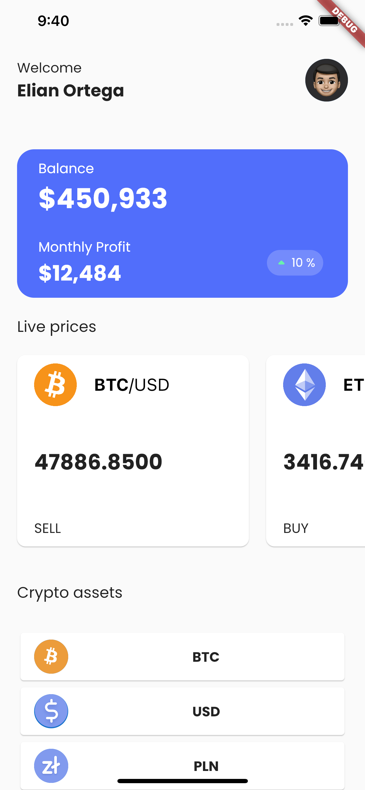
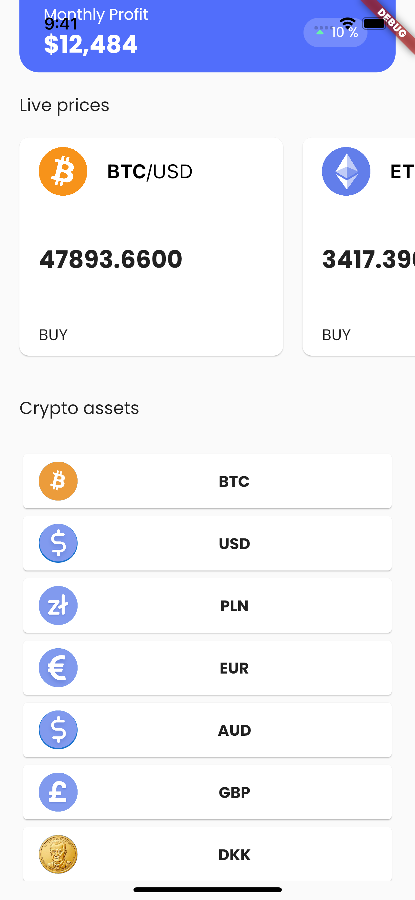

# mobile-app-test

Be sure to read **all** of this document carefully, and follow the guidelines within.

## Flutter Version

We use differente projects versions depending on what we want to achieve. We stay between stable and beta. Please user a flutter version greater than or equal to `2.5.1` for the challenge. User dart `2.13.0` or greater.

## Requirements

### App Structure


## Test Coverage

To demonstrate your experience writing different types of tests in Flutter please do the following:

- Choose ONE class and achieve 100% test coverage.
- Choose ONE page and achieve 100% test coverage.

Feel free to add more tests as you see fit but the above is the minimum requirement.

## Design
This is the design for this code challenge. Feel free to change the name in the top to yours. The **balance blue card** is a dummy component with no state. 

The **Live Prices** section shows the current live prices for 3 cryptocurrencies Bitcoin, Etherium and Cardano. The real time data is comming via a web socket described in the next section. 

Finally the **Crypto Assets** section displays a list of all the crypto assets names and images. 

Please see the gif for a quick demo.

 <div style="text-align: center">
    <table>
        <tr>
            <td style="text-align: center">
                    
            </td>            
            <td style="text-align: center">
                    
            </td>                     
        </tr>
        <tr>
            <td style="text-align: center">
                    
            </td>                                
        </tr>
    </table>
</div>

## API
The [CoinAPI](https://docs.coinapi.io/#md-docs) is used as the API for this application. To use the API you just need an API key. To get one:
1. Go to https://docs.coinapi.io/#md-docs.
2. Input your email in the top right corner
3. Click the button on the top right corner **GET A FREE API KEY**
4. You'll recieve your api key in your email.

As you saw in the design and demo, the **Live prices** is using real time data from a web socket. To make the implementation easier for you here is some code that you can use:

### Web Socket Connection
To connect to the web socket you could do something as simple as this:
```dart
 Future<WebSocket> connectWs() async {
    final baseURI = Uri.parse('wss://ws-sandbox.coinapi.io/v1/');
    final _uri = Uri(
      scheme: webSocketScheme,
      host: baseURI.host,
      port: baseURI.port,
      path: baseURI.path,
    );

    final socket = await WebSocket.connect(_uri.toString());

    socket.add(
      json.encode({
        "type": "hello",
        "apikey": apiKey,
        "heartbeat": false,
        "subscribe_data_type": ["trade"],
        "subscribe_filter_symbol_id": [
          r"COINBASE_SPOT_BTC_USD$",
          r"COINBASE_SPOT_ETH_USD$",
          r"COINBASE_SPOT_ADA_USD$",
        ]
      }),
    );

    return socket;
  }
```

This will return a web socket that is constantly being udated with json objects for (BTC, ETH, ADA) in this format:

```json
/// BTC vs USD
{
    "time_exchange": "2021-09-19T15:16:06.0423410Z",
    "time_coinapi": "2021-09-19T15:16:06.1435116Z",
    "uuid": "72c3db97-6d22-41dd-9b1a-332db94e50eb",
    "price": 47643.66,
    "size": 0.00089206,
    "taker_side": "SELL",
    "symbol_id": "COINBASE_SPOT_BTC_USD",
    "sequence": 37231,
    "type": "trade"
}

/// ETH vs USD
{
    "time_exchange": "2021-09-19T15:16:06.0772860Z",
    "time_coinapi": "2021-09-19T15:16:06.1440249Z",
    "uuid": "e0a9277e-1c58-4a61-b987-aad8c4f9d926",
    "price": 3350.31,
    "size": 0.36,
    "taker_side": "BUY",
    "symbol_id": "COINBASE_SPOT_ETH_USD",
    "sequence": 36313,
    "type": "trade"
}

/// ADA vs USD
{
    "time_exchange": "2021-09-19T15:16:05.5855000Z",
    "time_coinapi": "2021-09-19T15:16:05.6495320Z",
    "uuid": "0446f7d0-2eaf-44bd-b503-752990327981",
    "price": 2.3603,
    "size": 584.04,
    "taker_side": "SELL",
    "symbol_id": "COINBASE_SPOT_ADA_USD",
    "sequence": 15601,
    "type": "trade"
}
```

### Crypto Assets 

```json
/// Crypto assets json response
[
    {
        "asset_id": "BTC",
        "url": "https://s3.eu-central-1.amazonaws.com/bbxt-static-icons/type-id/png_512/4caf2b16a0174e26a3482cea69c34cba.png"
    },
    {
        "asset_id": "USD",
        "url": "https://s3.eu-central-1.amazonaws.com/bbxt-static-icons/type-id/png_512/0a4185f21a034a7cb866ba7076d8c73b.png"
    },
    {
        "asset_id": "PLN",
        "url": "https://s3.eu-central-1.amazonaws.com/bbxt-static-icons/type-id/png_512/3f682b5b77ec4d8cb612b8ff3ac748f7.png"
    },
]
```

```dart
Future<List<CryptoAsset>> getCryptoAssets() async {
    final result = await dioClient.get<List<dynamic>>(
        'https://rest.coinapi.io/v1/assets/icons/100',
        options: Options(
        headers: <String, String>{
            'X-CoinAPI-Key': '{{API_KEY}}'
        },
        ),
    );

    return result.data!
        .map((dynamic e) => CryptoAsset.fromJson(e as Map<String, dynamic>))
        .toList();
}
```

### State Management

Please restrict your usage of state or dependency injection to the following options:

1. [bloc](https://pub.dev/packages/bloc/versions/7.2.0-dev.3)
2. [riverpod](https://pub.dev/packages/riverpod/versions/1.0.0-dev.7)
3. [riverbloc](https://pub.dev/packages/riverbloc/versions/1.0.0-dev.1)

We ask this because this challenge values consistency and efficiency over ingenuity. Using commonly used libraries ensures that we can review your code in a timely manner and allows us to provide better feedback.

## Coding Values

At **Hypervolt** we strive to build applications that have

- Consistent architecture
- Extensible, clean code
- Solid testing
- Good security & performance best practices

We value great development practices in general, like clear and cosistent commits.

### Clear, consistent architecture

Approach your submission as if it were a real world app. This includes Use any libraries that you would normally choose.

_Please note: we're interested in your code & the way you solve the problem, not how well you can use a particular library or feature._

### Easy to understand

Writing boring code that is easy to follow is essential at **Hypercolt**.

More on [boaring code](https://verygood.ventures/blog/boring-code-part-1).

We're interested in your method and how you approach the problem just as much as we're interested in the end result.

### Solid testing approach

While the purpose of this challenge is not to guage whether you can achieve 100% test coverage, we do seek to evaluate whether you know how & what to test.

## Bonus Requirements

If you are feeling up to it and want to add some more functionality to the application try some of these bonus items:

1. Animations
2. More coins for **Live prices**
3. Any other section/page using another rest api endpoint from the [CoinAPI](https://docs.coinapi.io/#md-docs).


## Q&A

> Where should I send back the result when I'm done?

Fork this repo and send us a pull request when you think you are done. There is no deadline for this task unless otherwise noted to you directly.

> What if I have a question?

Just create a new issue in this repo and we will respond and get back to you quickly.